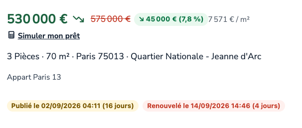
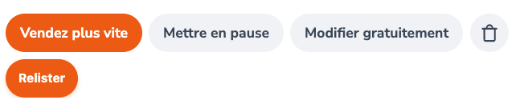
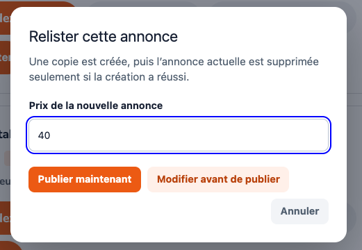
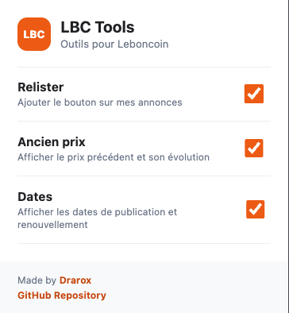

<div align="center">
  <h1>LBC Tools</h1>
  <p><strong>A practical companion for Leboncoin.</strong><br>Spot price changes, understand listing age, and relist your own ads in a few clicks.</p>

  [](https://chromewebstore.google.com/detail/lbc-tools)
  [](https://addons.mozilla.org/addon/lbc-tools)
  [](https://github.com/Drarox/lbc-tools)
</div>

## About

Leboncoin displays the current price, but not the context behind it. LBC Tools adds price history and allows you to relist your ads in a few clicks.

- **See price changes at a glance**: the previous price, absolute change, and percentage are displayed beside the existing price.
- **Read the history of a listing**: publication and renewal dates include a day count and color-coded age.
- **Relist without re-entering everything**: publish a replacement ad directly or open an editable draft first.

## Preview

<table>
  <tr>
    <td width="50%" align="center">
      <br>
      <sub><b>Previous price, amount, and percentage change</b></sub>
    </td>
    <td width="50%" align="center">
      <br>
      <sub><b>One-click relisting</b></sub>
    </td>
  </tr>
  <tr>
    <td align="center">
      <br>
      <sub><b>Relisting popup</b></sub>
    </td>
    <td align="center">
      <br>
      <sub><b>Simple settings</b></sub>
    </td>
  </tr>
</table>

## Installation

### Chrome Web Store (Chrome, Edge, Brave, Opera, etc.)

[](https://chromewebstore.google.com/detail/lbc-tools)

### Firefox Add-ons

[](https://addons.mozilla.org/addon/lbc-tools/)

### Manual Installation (Developer Mode)

1. **Download**: Clone or download this repository

   ```bash
   git clone https://github.com/Drarox/lbc-tools.git
   ```

2. **Chromium-based browsers**:
   - Open `chrome://extensions/`
   - Enable "Developer mode"
   - Click "Load unpacked"
   - Select the extension folder

3. **Firefox**:
   - Open `about:debugging`
   - Click "This Firefox"
   - Click "Load Temporary Add-on"
   - Select the `manifest.json` file

## Privacy and safety

LBC Tools only runs on `leboncoin.fr` and uses Leboncoin’s own authenticated session to perform the actions you explicitly request. It does not send your data to a third-party service.

Relisting uses Leboncoin’s web APIs, which can change without notice. Always review an editable draft before publishing and make sure the selected price is correct.

## Contributing

Ideas, bug reports, and pull requests are welcome. Please open an issue first for significant changes so the implementation can be discussed.

## License

This project is licensed under the GPL-3.0 License - see the [LICENSE](LICENSE) file for details.

## Disclaimer

This extension is independent and not affiliated with or endorsed by Leboncoin. Use it at your own risk and always comply with Leboncoin’s Terms of Service.
